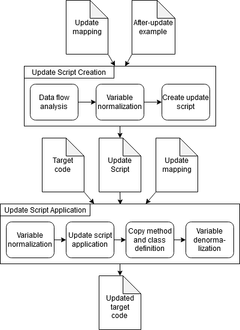

# AndroEvolve: Automated Update for Android Deprecated API Usages

## AndroEvolve Architecture
AndroEvolve provide two main functionalities:
1. Transformation Inference: Use an update-example and the API mapping to create the update patch in Semantic patch Language (SmPL).
2. Transformation Application: Use the created update patch, API mapping, and an input target file to update the deprecated API within the target file according the transformation specified in the update patch.

The architecture and workflow of AndroEvolve is provided in the following figure:


Detailed description on each components of AndroEvolve is available in our full paper [[1]](#1), available in the following arxiv link: https://arxiv.org/abs/2011.05020

## Requirements
AndroEvolve is compiled with several dependencies:

 - javaparser-core-3.15.10
 - javaparser-symbol-solver-core-3.15.10
 - javaparser-symbol-solver-logic-3.15.10
 - javaparser-symbol-solver-model-3.15.10
 - guava-28.2-jre
 - javassist-3.26.0-GA

This repository is also provided with the IntelliJ project configuration file which contain the run and build configuration for the project. For easier compilation, please use IntelliJ 2019 or above to open this project.

## Run Requirements

AndroEvolve utilize Coccinelle4J [[2]](#2), which source code and replication package is available in the following link: [Coccinelle4J](https://ink.library.smu.edu.sg/cgi/viewcontent.cgi?article=5816&context=sis_research).

AndroEvolve also requires the Android SDK JAR file for its symbol solver. Put the Android JAR file in an android_jars/ folder.

Using AndroEvolve JAR within the Coccinelle4J replication package is the recommended approach to easily run AndroEvolve.

## AndroEvolve Replication and JAR

The compiled JAR file of AndroEvolve is available for easier use in the following link: [JAR link](https://drive.google.com/file/d/1e13NiA8pZWRFZEHPKSBf8aIguLamWFaX/view?usp=sharing)

We also provided a docker image containing the Coccinelle4J implementation, AndroEvolve JAR file, and dataset used in AndroEvolve's evaluation. This docker can be pulled from docker hub using the following commands:

```
docker pull androevolve/icse
```

## Usage Commands

### Patch Creation
```
java -jar AndroEvolve.jar --generate-patch <deprecated_api_signature> <updated_api_signature> --input <update_example_path> --output <output_path>
```

### Patch Application

```
java -jar AndroEvolve.jar --apply-patch <deprecated_api_signature> <updated_api_signature> --input <target_filepath> --patch <patch_filepath> --output <output_path>
```

## Usage Example

Consider the following pair of Android deprecated and updated APIs:
```
deprecated: android.widget.TimePicker#getCurrentMinute()#java.lang.Integer
updated: "android.widget.TimePicker#getMinute()#int"
```
And the following update example:
```
    public void setAlarm(View view) {
        TimePicker picker = (TimePicker) findViewById(R.id.timePicker);
        int hour = 0;
        int minutes = 0;

        if (android.os.Build.VERSION.SDK_INT >= android.os.Build.VERSION_CODES.M) {
            hour = picker.getHour();
            minutes = picker.getMinute();

        } else {
            hour = picker.getCurrentHour();
            minutes = picker.getCurrentMinute();
        }
```

We can create the update patch using the following commands:
```
java -jar AndroEvolve.jar --generate-patch "android.widget.TimePicker#getCurrentMinute()#java.lang.Integer" "android.widget.TimePicker#getMinute()#int" --input Example/getCurrentMinute.java --output Patch/getCurrentMinute.cocci
```
Which result in the following update patch:
```
@update_patch@
expression exp0;
identifier classIden;
@@
...
+ if (android.os.Build.VERSION.SDK_INT >= 23) {
+ classIden.getHour();
+ } else {
 classIden.getCurrentHour();
+ }
```

Then, consider the following target file containing the deprecated API usages.
```
backButton.setOnClickListener(new View.OnClickListener() {
    @Override
    public void onClick(View v) {
        saveClicked(timePicker.getCurrentMinute(), timePicker.getCurrentHour(), datePicker.getDayOfMonth(), datePicker.getMonth(), "back");
        saveClicked(minute, hour, day, month, "back");
    }
});
```
We can apply the update patch with the following commands:
```
java -jar AndroEvolve.jar --apply-patch "android.widget.TimePicker#getCurrentMinute()#java.lang.Integer" "android.widget.TimePicker#getMinute()#int" --input Target/getCurrentMinute.java --patch Patch/getCurrentMinute.cocci --output Result/getCurrentMinute.java
```

Which results in the following updated code:
```
backButton.setOnClickListener(new View.OnClickListener() {
    @Override
    public void onClick(View v) {
        int tempFunctionReturnValue;
        if (android.os.Build.VERSION.SDK_INT >= 23) {
            tempFunctionReturnValue = timePicker.getHour();
        } else {
            tempFunctionReturnValue = timePicker.getCurrentHour();
        }
        saveClicked(timePicker.getCurrentMinute(), tempFunctionReturnValue, datePicker.getDayOfMonth(), datePicker.getMonth(), "back");
        saveClicked(minute, hour, day, month, "back");
    }
});
```

## References
<a id="1">[1]</a> S.  A.  Haryono,  F.  Thung,  D.  Lo,  L.  Jiang,  J.  Lawall,  H.  J.  Kang,L.  Serrano,  and  G.  Muller,  “AndroEvolve:  Automated  Android  APIupdate with data flow analysis and variable denormalization,” 2020.
<a id="2">[2]</a> Hong Jin Kang, Ferdian Thung, Julia Lawall, Gilles Muller, Lingxiao Jiang, and David Lo. Semantic patches for Java program transformation (experience report). In 33rd European Conference on Object-Oriented Programming (ECOOP 2019). Schloss Dagstuhl-Leibniz-Zentrum fuer Informatik, 2019.

